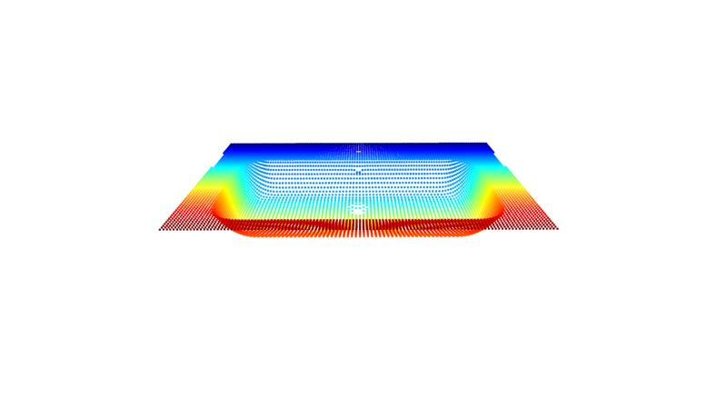
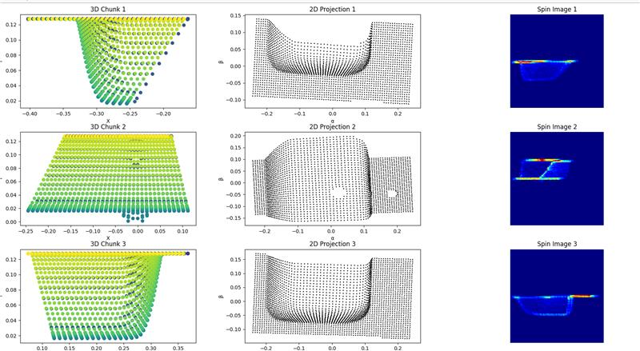

# 2D spin images gneeration from 3D point cloud meshes
Python code to create spin images from 3D point cloud meshes.


 

when a point cloud of an object like the basin above is entered, the script separates the pcd into three chunks and produces  spin images as thevoutput shown below.



The inner working of code and functions  is well commented in the script itself.


Referenced from Spin-Images: A Representation for 3-D Surface Matching by Andrew Johnson


## Citation
```bibtex
@phdthesis{Johnson-1997-14453,
  author = {Andrew Johnson},
  title = {Spin-Images: A Representation for 3-D Surface Matching},
  year = {1997},
  month = {August},
  school = {Carnegie Mellon University},
  address = {Pittsburgh, PA},
  number = {CMU-RI-TR-97-47},
  keywords = {shape representation, 3-D surface matching, object recognition, spin-images, surface mesh, surface registration, object modeling, scene clutter.},
}

